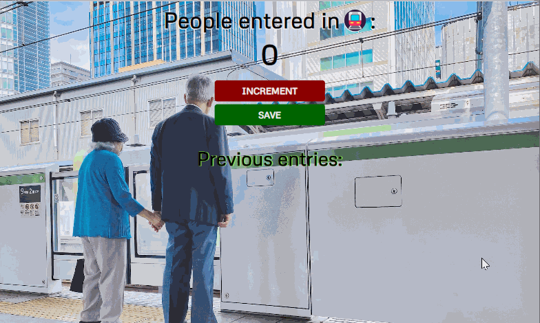

# **Passenger Counter**

# Overview

Welcome to the Passenger Counter website! 🚇 This interactive platform allows you to track the number of people entering a subway throughout the day. The initial display shows 0, indicating that there are currently no passengers in the subway. As people enter, use the increment button to update the count. If you want to keep a record of the entries, simply click on the save button. The saved entries will be displayed next to the "Previous Entries" text for reference.

# Website

Live Version [here](https://passengercounter03.netlify.app/)

# Preview

## What I've Learned

This project has been instrumental in expanding my understanding of DOM manipulation. Through the development of the Passenger Counter, I gained hands-on experience in manipulating text elements on the DOM. This simple yet effective project serves as a valuable introduction to the world of DOM manipulation.

## Getting Started

Explore the Passenger Counter by following these steps:

1. Clone the repository.
2. Open the index.html file in your browser.
3. Begin counting the number of people entering the subway by clicking the increment button.
4. Save the count by clicking the save button.
5. View the saved entries next to the "Previous Entries" text.

## Features

- **Dynamic Counter**: The webpage features a dynamic counter that updates as you click the increment button.

- **Save Functionality**: Save the count of passengers with the click of a button to keep track of entries.

- **Previous Entries Display**: Easily reference the saved entries, displayed conveniently next to the "Previous Entries" text.

# Author

Komal | Software Developer | [Portfolio](https://kaurkomal.com/) | [LinkedIn](https://www.linkedin.com/in/hssa03/)